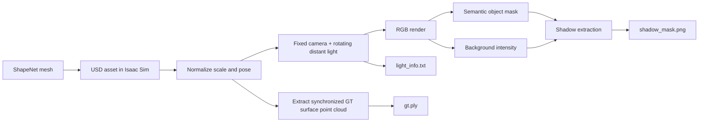

# Multi-Illumination Shadow Dataset Generator

**Synthetic Data Pipeline for Shadow2Points using NVIDIA Isaac Sim and ShapeNet**

This repository contains the synthetic-data generation pipeline used for the **Shadow2Points** research project. It creates synchronized multi-illumination shadow observations and ground-truth 3D point clouds for learning shadow-based 3D reconstruction.

Model and training code: **[shadow3d-recon](https://github.com/Jony-do-ai/shadow3d-recon)**

---

## Overview

The goal of this pipeline is to generate controlled training data in which the relationship among **3D geometry, illumination direction, rendered appearance, and cast shadows** is explicitly known.

For each 3D object, the pipeline:

1. loads a ShapeNet-derived USD asset into NVIDIA Isaac Sim,
2. normalizes and positions the object in a common world coordinate system,
3. extracts a synchronized ground-truth surface point cloud from the transformed USD stage,
4. keeps the camera fixed,
5. rotates a distant light through multiple illumination directions,
6. renders RGB images,
7. derives a shadow mask using semantic object segmentation and background intensity,
8. saves the light orientation for every frame.

The default configuration generates **10 illumination observations per object**.

---

## Pipeline



---

## Why Synthetic Data?

Shadow-based 3D reconstruction requires paired observations that are difficult to acquire at scale in the real world:

- the exact 3D geometry of each object,
- multiple controlled illumination directions,
- spatially aligned shadow observations,
- and consistent camera parameters.

Isaac Sim provides a controllable rendering environment in which all of these variables can be generated together. This makes it possible to study the inverse problem of recovering geometry from shadows under known illumination.

---

## Generated Data

For every object instance, the generator exports a synchronized ground-truth point cloud and a sequence of illumination-dependent observations.

The current generator writes data in the following form:

```text
output/dataset/
└── sequences/
    └── seq_<id>_<model_id>/
        ├── object_geometry/
        │   └── gt.ply
        ├── frame_000/
        │   ├── rgb_with_shadow.png
        │   ├── shadow_mask.png
        │   └── light_info.txt
        ├── frame_001/
        │   ├── rgb_with_shadow.png
        │   ├── shadow_mask.png
        │   └── light_info.txt
        └── ...
```

### `gt.ply`

The ground-truth point cloud is sampled from the object's **final transformed geometry in the Isaac Sim world coordinate system**. The extraction code:

- traverses all mesh children under the object prim,
- applies the final local-to-world transform,
- merges the mesh geometry,
- removes degenerate/duplicated elements,
- and uniformly samples points from the resulting surface.

The current generator exports **5000 surface points** before any normalization performed by the downstream training loader.

### `rgb_with_shadow.png`

RGB image rendered from the fixed camera under the current illumination direction.

### `shadow_mask.png`

Binary shadow mask derived from the rendered image. Semantic segmentation is used to exclude the target object itself, after which dark background pixels are identified using an adaptive threshold based on the background intensity distribution.

### `light_info.txt`

Stores the light orientation for each observation:

```text
theta:45.0, phi:<azimuth>
```

With the default setup, `theta` remains fixed at **45°** while `phi` is distributed over a full **360°** rotation according to the configured number of frames.

---

## Scene Setup

The current implementation uses:

- a fixed ground plane,
- a fixed camera,
- a USD `DistantLight`,
- semantic labeling for the target object,
- and ShapeNet-derived object geometry.

A fixed camera is important because it keeps all shadow observations spatially aligned while illumination changes.

Before rendering, each object is rescaled and positioned so that the transformed geometry is aligned with the ground plane. The same final pose is used to export the ground-truth point cloud, keeping the 2D observations and 3D target synchronized.

---

## Repository Structure

```text
rtx_lidar_dataset/
├── assets/                 # project assets
├── config/
│   └── dataset.yaml        # dataset-generation configuration
├── file_io/                # file utilities
├── scene/
│   └── generator.py        # main sequence-generation logic
├── shapenet_models/        # ShapeNet-related assets/utilities
├── sim_utils/              # Isaac Sim helper utilities
├── main.py
├── run.py                  # main Isaac Sim entry point
├── run_isaac.bat           # Windows helper launcher
├── requirements.txt
└── README.md
```

---

## Requirements

This project requires **NVIDIA Isaac Sim**. The repository does not currently pin a specific Isaac Sim release, so for strict reproducibility it is recommended to record the exact version used for your experiments.

Python-side dependencies include:

- NumPy
- Open3D
- Pillow
- PyYAML
- trimesh (optional)
- matplotlib (optional)
- SciPy (optional)

Install them using the Python environment bundled with Isaac Sim:

```bash
<ISAAC_SIM_PYTHON> -m pip install -r requirements.txt
```

For example, on Windows `<ISAAC_SIM_PYTHON>` is typically the `python.bat` shipped with your Isaac Sim installation.

---

## ShapeNet Asset Preparation

The generator expects ShapeNet meshes to be available as USD assets that Isaac Sim can load.

The project workflow used for the experiments was:

```text
ShapeNet download
      ↓
archive extraction
      ↓
OBJ / mesh assets
      ↓
USD conversion for Isaac Sim
      ↓
organized ShapeNet subset
      ↓
dataset generation
```

Before running the generator, verify the `shape_library_dir` used in `run.py`. The current script points to a project-relative ShapeNet subset and may need to be adjusted to match your local asset location.

---

## Configuration

Edit:

```text
config/dataset.yaml
```

Current default values include:

```yaml
num_scenes: 1
frames_per_scene: 10
output_dir: output/dataset
seed_base: 123

sensor:
  camera:
    resolution: [1024, 1024]
    position: [0.0, -0.2, 1.5]
    look_at: [0.0, 0.0, 0.2]
  lidar:
    position: [0.0, 0.0, 2.0]
    config: "Example_Rotary"
```

The current Shadow2Points data path primarily uses the rendered shadows and synchronized ground-truth point cloud. Some sensor settings remain in the configuration because this repository evolved from a broader RTX/LiDAR dataset-generation prototype.

---

## Running the Generator

The Isaac Sim application must be initialized before importing Isaac-specific project modules. `run.py` handles this startup sequence.

Run with the Python interpreter bundled with Isaac Sim:

```bash
<ISAAC_SIM_PYTHON> run.py
```

On Windows, the repository also contains:

```text
run_isaac.bat
```

which can be adapted to your local Isaac Sim installation path.

Before a large generation run, verify:

1. the ShapeNet/USD model directory in `run.py`,
2. the output path in `config/dataset.yaml`,
3. the configured number of illumination frames,
4. that a small single-object run produces valid `shadow_mask.png` and `gt.ply` files.

---

## Relationship to Shadow2Points

This repository produces the synthetic observations used by the reconstruction model in:

**[Jony-do-ai/shadow3d-recon](https://github.com/Jony-do-ai/shadow3d-recon)**

The reconstruction model consumes:

- `shadow_mask.png`,
- the illumination direction derived from `light_info.txt`,
- and `object_geometry/gt.ply` as the 3D supervision target.

> The generator and training repository currently use slightly different intermediate folder layouts. The training repository documents the structure expected by its dataset loader. A future cleanup should add an explicit export/conversion step so that both repositories form a one-command pipeline.

---

## Reproducibility Notes

For research use, the following details should be kept fixed and recorded:

- Isaac Sim version,
- ShapeNet subset/category selection,
- object preprocessing and USD conversion procedure,
- camera pose and resolution,
- number of illumination directions,
- light elevation/azimuth convention,
- random seed,
- and downstream train/test split.

The repository already stores the main generation parameters in `config/dataset.yaml`; additional environment/version metadata will improve reproducibility further.

---

## Known Limitations

- The current pipeline generates **synthetic** observations, so a domain gap may exist when transferring to real shadows.
- Shadow masks are extracted with an intensity-based rule and may be sensitive to rendering/material conditions.
- The current illumination schedule is controlled and regular rather than learned or optimized for reconstruction information content.
- The codebase still contains development-era assumptions such as local asset-path configuration and should be cleaned further for one-command reproduction.

These limitations are also useful research directions, especially for studying robust shadow formation, sim-to-real transfer, and physics-informed reconstruction.

---

## Paper

This dataset pipeline supports:

**Shadow2Points: End-to-End 3D Reconstruction from Multi-illumination Shadow Observations**  
CVAA 2026 — **Accepted**

The final citation and paper link will be added after publication of the proceedings.

---

## Project Status

This is a research-oriented data-generation codebase. The current release documents the pipeline used during development while the repository is being reorganized for easier external reproduction.
